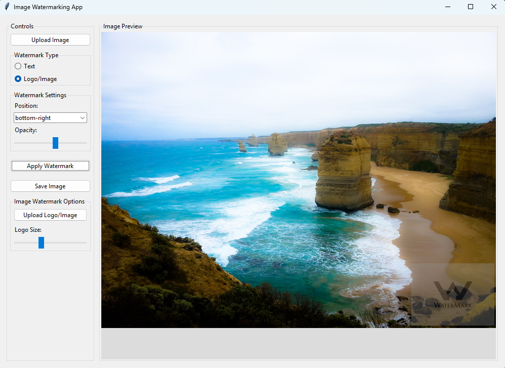

# Image Watermarking Application

A desktop application built with Python and Tkinter that allows you to easily add watermarks to your images. Whether you want to add a text watermark or overlay an image/logo, this tool provides a simple yet powerful interface for protecting your visual content.



## Features

- **Dual Watermarking Options**: Choose between text or image/logo watermarks
- **Customizable Text Watermarks**:
  - Adjustable font size
  - Custom text color selection
  - Variable opacity
- **Flexible Image Watermarks**:
  - Upload any image as a watermark
  - Resize watermark with intuitive slider control
  - Adjust opacity for subtle branding
- **Positioning Control**: Place your watermark in any of five positions:
  - Top-left
  - Top-right
  - Center
  - Bottom-left
  - Bottom-right
- **Live Preview**: See how your watermark looks before saving
- **Multiple Export Options**: Save in PNG or JPEG formats

## Use Cases

- Add your website URL to photos before posting online
- Brand your photography with your logo or name
- Add copyright information to protect your intellectual property
- Create professional-looking branded images for social media
- Add "Draft" or "Confidential" markings to documents

## Installation

### Prerequisites
- Python 3.6 or higher
- Pip package manager

### Setup
1. Clone this repository or download the source code
   ```
   git clone https://github.com/yourusername/watermark-app.git
   cd watermark-app
   ```

2. Create and activate a virtual environment (recommended)
   ```
   python -m venv venv
   # On Windows
   venv\Scripts\activate
   # On macOS/Linux
   source venv/bin/activate
   ```

3. Install required packages
   ```
   pip install pillow
   ```

4. Run the application
   ```
   python main.py
   ```

## How to Use

1. **Launch the application** by running `main.py`
2. **Upload your image** by clicking "Upload Image"
3. **Choose watermark type**:
   - For text watermark:
     - Select "Text"
     - Enter your text
     - Adjust size and color as needed
   - For image watermark:
     - Select "Logo/Image" 
     - Upload your logo/image
     - Adjust size using the slider
4. **Configure watermark settings**:
   - Select position from the dropdown
   - Adjust opacity with the slider
5. **Click "Apply Watermark"** to preview
6. If satisfied, **click "Save Image"** to export

## Technical Details

The application is built using:
- **Python 3**: Core programming language
- **Tkinter**: GUI framework for the interface
- **PIL/Pillow**: Python Imaging Library for image manipulation
- **Object-Oriented Design**: Modular code structure with the `WatermarkApp` class

## Project Structure

```
watermark_app/
├── main.py           # Main application code
├── README.md         # This file
└── screenshots/      # Example screenshots
    └── app_screenshot.png
```

## Contributing

Contributions are welcome! Here are some ways you can contribute:
- Report bugs and issues
- Add new features or enhance existing ones
- Improve documentation
- Provide feedback on usability

## Future Improvements

- Add batch processing for multiple images
- Support for custom fonts
- Rotation and custom angle positioning for watermarks
- Drag-and-drop positioning in the preview
- Save user preferences between sessions

## License

This project is licensed under the MIT License - see the LICENSE file for details.

---

## Development Note

This application was developed with assistance from AI tools. While the core functionality, requirements definition, and testing were human-directed, AI was used to help generate some code portions, optimize implementation, and assist with documentation.
